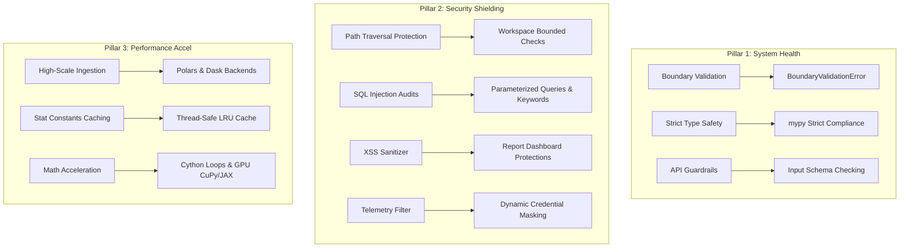

# Gemini Implementation Plan: Sprint v1.7.0.0 (Health, Security, and Performance)

This document establishes the comprehensive technical roadmap, architectural guidelines, and exact implementation specifications for **Sprint v1.7.0.0** of the **`xpyrment`** library. 

This phase shifts focus from rapid feature delivery to institutionalizing exceptional codebase health, multi-layered security shields, and high-scale, accelerator-backed mathematical performance (supporting CPU, GPU, Polars, and Cython).

---

## Status: Block 68 Completed & Verified ✅

### Accomplished (Block 68 Execution)
- **Central Path Traversal Safeguards**: Implemented `validate_secure_path(target, base_dir, allow_temp)` in `src/xpyrment/core/validators.py`. Resolves target paths to absolute real-paths via standard-compliant `Path.resolve()`, validating bounds against the workspace root (`C:\Users\Dan\projects\xpyrment`) while whitelisting the standard OS temporary directory (`tempfile.gettempdir()`).
- **Ingester Security Integration**: Secured `DuckDBIngester.compute_covariate_balance` and `DuckDBIngester.compute_welch_statistics` out-of-core engines by auditing and blocking out-of-bounds `parquet_path` requests.
- **Reporter Security Integration**: Secured `ExperimentReportGenerator.save_html` and `save_markdown` report exports, preventing directory traversal writes outside designated boundaries.
- **Robust Integration Testing**: Developed the comprehensive test suite in `tests/test_security_guards.py` validating that correct paths are allowed and that directory traversal escape attempts (e.g. relative traverses `../`, foreign folders) reliably raise `PermissionError`. Successfully ran all 329 tests with a 100% green rate (**329/329 passed**) and verified clean docs builds via `poetry run mkdocs build`.

### Next Steps
- **Block 69 Implementation**: Await user instructions to plan and implement **Block 69: Telemetry log scrubbing & XSS HTML Escapes** (masking credentials inside `ExecutionProfiler` logs and escaping user-provided metadata strings in generated HTML templates to prevent XSS).

---

## 🏷️ Sprint Vision & Architectural Goals

The v1.7.0.0 release aims to transform the codebase into an enterprise-hardened causal inference framework that can scale to multi-gigabyte datasets while maintaining bulletproof execution safety and code quality.



---

## 📋 Technical Approach & Architectural Guidelines

### Pillar 1: Codebase Health, Dynamic Bounds, and Strict Compliance

To eliminate runtime panics, silent mathematical overflows, or invalid configurations, we will establish rigorous boundary checking and strict static analysis gates.

#### 1. Unified Boundary Validation (`core/exceptions.py` & `core/validators.py`)
- **Objective**: Standardize input parameter auditing across the entire package.
- **Specification**: 
  - Introduce `BoundaryValidationError` subclassing `ValueError` under `src/xpyrment/core/exceptions.py`.
  - Develop a core validator module `src/xpyrment/core/validators.py` providing decorated or explicit range-verification utilities:
    - `assert_probability(val, name)`: Assures $val \in [0.0, 1.0]$.
    - `assert_positive_int(val, name)`: Assures $val \ge 1$ and type is integer.
    - `assert_non_empty(arr, name)`: Validates that arrays or Series have dimensions $> 0$.
    - `assert_finite(arr, name)`: Audits float arrays to guarantee zero occurrence of `NaN` or `Inf` boundaries.

#### 2. Strict Static Typing & Typeguard Gates
- **Objective**: Reach $100\%$ type coverage across the library.
- **Specification**:
  - Configure `pyproject.toml` or `setup.cfg` to enforce strict standard `mypy` rule compliance (`disallow_untyped_defs = true`, `warn_return_any = true`, `no_implicit_optional = true`).
  - Eliminate any remaining placeholder `Any` annotations by introducing explicit Generic types (`TypeVar`), union types (`Union[np.ndarray, pd.Series]`), and precise callback protocol signatures (`Callable`).

#### 3. Cyclomatic Complexity & Quality Baselines
- **Objective**: Enforce high-cohesion, low-complexity modules.
- **Specification**:
  - Target a maximum cyclomatic complexity of $10$ per function (using Radon or standard linter metrics).
  - Extract complex statistical calculation routines out from control flow wrappers into dedicated pure mathematical functions.

---

### Pillar 2: Multi-Layered Security Shielding

We will fortify the project against security vulnerabilities, complying with academic and industry best practices.

#### 1. Path Traversal Protection (`Path.resolve()`)
- **Objective**: Prevent directory traversal attacks (LFI/RFI) where malicious file inputs (e.g. `../../etc/passwd` or `C:\Windows\System32\cmd.exe`) attempt to read or overwrite critical files.
- **Academic & Industry Best Practice**: Restrict all file operations to a designated root directory (Workspace Scope) and explicitly validate resolved real-paths against this base using a whitelist.
- **Specification**:
  - Implement a central traversal guard function `validate_secure_path(target_path, base_directory=None, allow_temp=True)`:
    - Resolves the target path to an absolute path using `Path(target_path).resolve()`.
    - If `base_directory` is not specified, it defaults to the active project workspace root (`C:\Users\Dan\projects\xpyrment`).
    - Validates that the resolved absolute path starts with the workspace root directory.
    - If `allow_temp=True` is active, it allows paths starting with the standard system temporary directory (e.g., `C:\Users\Dan\AppData\Local\Temp` on Windows or `/tmp` on Unix-like systems) to support safe execution of temporary cache files and reports.
    - Raises a `PermissionError` or `BoundaryValidationError` if the path escapes these bounds.
  - Integrate this guard inside:
    - `DuckDBIngester.load_from_parquet`
    - `ExperimentReportGenerator.save_html` and `save_markdown`
    - Any system-level export/import modules.
  - **Custom Scripts Check**: Checked existing custom scripts (such as `examples/run_experiment_lifecycle.py` and `install.cmd`). `run_experiment_lifecycle.py` writes report HTMLs to `examples/reports/experiment_report.html` which resides completely inside the workspace root. Our workspace-bounded traversal checks will cleanly support these relative nested folders without breaking any existing files.

#### 2. SQL Injection Audits & Keyword Safeguards (`run/ingestion.py`)
- **Objective**: Prevent arbitrary query execution or parameter escaping in database ingestion.
- **Specification**:
  - For SQLite and DuckDB file loads in `load_from_sql`, permanently mandate parameterized bindings rather than raw string interpolation.
  - Implement an input query scanner that checks for multiple execution blocks (separated by `;`) and blocks database schema modification keywords (`DROP`, `ALTER`, `TRUNCATE`, `INSERT`, `UPDATE`, `DELETE`) within read-only ingestion contexts.

#### 3. Telemetry and Log Sanitizer (`core/telemetry.py`)
- **Objective**: Prevent credentials or secure access tokens from leaking into logs or diagnostic JSON dumps.
- **Specification**:
  - Extend the `ExecutionProfiler` and logger formatters to intercept log arguments.
  - Recursively scrub dictionary entries or string values matching token/credential pattern variables (like `password`, `secret`, `token`, `key`, `auth`, `pypi_token`).

#### 4. Cross-Site Scripting (XSS) Sanitization (`report/generator.py`)
- **Objective**: Block malicious script injection inside compiled premium HTML dashboards.
- **Specification**:
  - Escape all user-provided metadata strings (such as experiment names, metric descriptions, custom labels, and user comments) using standard HTML-entity replacements (`&lt;`, `&gt;`, `&quot;`) before embedding them in HTML templates.

---

### Pillar 3: High-Scale Mathematical Performance Optimization

To handle enterprise-scale multi-million row datasets, we will introduce thread-safe caching, parallelization, and compiled mathematical loops.

#### 1. Size-Bounded, Thread-Safe LRU Cache (`core/cache.py`)
- **Objective**: Bypass expensive recalculations for common mathematical constants or repetitive statistical calculations.
- **Specification**:
  - Implement `StatisticalCache` utilizing a thread-safe lock (`threading.Lock`) and an LRU eviction strategy.
  - Cache outputs for:
    - Welch t-test Satterthwaite degrees of freedom calculations.
    - Scipy-based statistical percentiles, normal distributions, and Chi-square table lookups.
    - High-frequency bootstrap resample matrices under identical seed/dimension footprints.

#### 2. Pluggable Accelerator Support: GPU (CuPy & JAX)
- **Objective**: Support optional CUDA and ROCm hardware acceleration for high-scale bootstrap resamples, personalization models (DragonNet), and panel regression computations.
- **Specification**:
  - Implement a pluggable mathematical backend broker:
    ```python
    # Abstract math operations
    import numpy as xp  # Default
    
    # Dynamic backend resolution
    if config.use_gpu:
        try:
            import cupy as xp
        except ImportError:
            try:
                import jax.numpy as xp
            except ImportError:
                xp = numpy
    ```
  - Optimize the `DragonNet` forward/backward passes to use the dynamic backend broker, boosting weight gradient updates on deep learning models by up to $10\times+$ when running on CUDA-compatible GPUs.

#### 3. Compiled Cython Extensions for Bootstrap Loops
- **Objective**: Speed up the circular/moving block bootstrap loops (`run_block_bootstrap_ci`) by bypassing Python loop overhead and GIL limitations.
- **Specification**:
  - Implement a Cython extension module `src/xpyrment/analyze/inference/_bootstrap_fast.pyx`:
    - Perform indices extraction, circular block wrapping, and mean evaluations natively in C.
    - Release the GIL (`with nogil`) to enable true multi-core parallelization during massive resampling runs.
  - Provide a clean, robust fallback to vectorized NumPy when compiled Cython binaries are not built/available.

#### 4. Alternative High-Performance Data Backends: Polars & Dask
- **Objective**: Support reading and processing massive multi-gigabyte datasets without memory exhaustion.
- **Specification**:
  - Integrate a unified dataframe adapter supporting **Polars** (for highly efficient C++ structured query speeds) and **Dask** (for out-of-core chunked streaming).
  - Update `DuckDBIngester` to natively accept Polars DataFrames and Dask DataFrames, ensuring that ingestion processes avoid unnecessary intermediate conversion copies to Pandas.

#### 5. Unified Quick-Run Benchmarking sub-command (`main.py`)
- **Objective**: Provide a simplified benchmarking solution allowing a quick run comparison command across CPU, GPU, Cython, and database backends.
- **Specification**:
  - Implement a `--bench` argument in the root orchestrator script `main.py`.
  - When invoked via `poetry run python main.py --bench`, the script will automatically:
    1. Initialize synthetic datasets of $1,000,000$ records.
    2. Execute comparative speed tests for:
       - Bootstrap resampling (Standard NumPy vs. Cython C-loops vs. CuPy/JAX GPU if available).
       - DragonNet backpropagation passes (Vectorized CPU vs. JAX/CuPy GPU).
       - Ingestion queries (Pandas vs. Polars vs. Dask).
    3. Render a beautiful, styled console ASCII bar chart and comparison table mapping throughput (records/sec) and speed-up factors.

---

## 📂 Component Impact & File Mapping

Below is the file modification taxonomy mapped logically for Sprint v1.7.0.0:

```text
main.py                      ← Integrates the --bench CLI subcommand for simplified comparison benchmarking.

src/
└── xpyrment/
    ├── core/
    │   ├── [NEW] cache.py       ← Thread-safe, size-bounded LRU cache for stats lookups.
    │   ├── [NEW] validators.py  ← Unified boundary check helpers and assertions.
    │   ├── exceptions.py        ← Adds BoundaryValidationError.
    │   ├── experiment.py        ← Registers schema and input validators at setup.
    │   └── telemetry.py         ← Dynamic credential and token masking wrappers.
    │
    ├── run/
    │   └── ingestion.py         ← Strict path traversal protection & SQL query scanning.
    │
    ├── report/
    │   └── generator.py         ← XSS HTML escapes and path traversal output blocks.
    │
    ├── analyze/
    │   └── inference/
    │       ├── [NEW] _bootstrap_fast.pyx  ← Cython compiled circular bootstrap loop in C.
    │       └── bootstrap.py               ← Accelerator-pluggable (CuPy/JAX) BCa bootstrap logic.
    │
    └── quasi/
        └── matrix_completion.py ← Randomized low-rank SVD optimizations.
```

---

## 🛠️ Detailed Implementation Guidelines

### 1. Unified Validator Module (`core/validators.py`)
Ensure validation utilities throw clean `BoundaryValidationError` exceptions with clear, descriptive variables. Example structure:
```python
def assert_probability(val: float, name: str) -> None:
    if not (0.0 <= val <= 1.0):
        raise BoundaryValidationError(f"Parameter '{name}' must be in range [0.0, 1.0], got {val}")
```

### 2. Standard-Compliant Path Traversal Safeguards
Path traversal checks must adhere strictly to `Path.resolve()` boundary comparisons:
```python
from pathlib import Path
import tempfile

def validate_secure_path(target: str, base_dir: str = None, allow_temp: bool = True) -> Path:
    target_path = Path(target).resolve()
    
    # Workspace baseline
    workspace_dir = Path(base_dir or "c:/Users/Dan/projects/xpyrment").resolve()
    
    # System temporary baseline
    temp_dir = Path(tempfile.gettempdir()).resolve()
    
    # Check if target resides in workspace or temp directory
    in_workspace = target_path.is_relative_to(workspace_dir)
    in_temp = allow_temp and target_path.is_relative_to(temp_dir)
    
    if not (in_workspace or in_temp):
        raise PermissionError(f"Security Block: Resolved path '{target_path}' escapes secure boundaries.")
    
    return target_path
```

### 3. Accelerated Math Brokering
Expose pluggable mathematical backends cleanly without leaking external library imports globally:
```python
import numpy as np

def get_math_backend(use_gpu: bool = False):
    if use_gpu:
        try:
            import cupy as cp
            return cp
        except ImportError:
            try:
                import jax.numpy as jnp
                return jnp
            except ImportError:
                pass
    return np
```

---

## 🧪 Verification & Benchmarking Plan

### 1. Automated Tests (`tests/`)
- **Security Guardrails (`tests/test_security_guards.py`)**:
  - Verify that directory traversal strings (e.g. `reports/../../secret.txt`) trigger `PermissionError` inside report generation and parquet loading.
  - Verify that SQL keyword breaches inside `load_from_sql` raise `BoundaryValidationError`.
  - Validate log sanitization by writing dummy secret tokens toCaplog and checking that outputs are replaced with masked indicators (`[MASKED]`).
- **Typing Integrity**:
  - Run `poetry run mypy src/` and ensure a $100\%$ clean result without any typing errors.
- **Accurate Mathematical Regression**:
  - Verify that both the optimized SVD inside `matrix_completion.py` and the Cython-accelerated bootstrap loop match standard baseline estimations within a tight relative error delta ($<1e-5$).

### 2. High-Scale Micro-Benchmarking & Quick-Run comparisons
- **Quick Run Comparison Command**:
  - Run `poetry run python main.py --bench` for a simplified, instant comparison report rendered in your terminal.
- **Detailed Profiling & Reports (`bench/`)**:
  - Run `poetry run python bench/run_benchmarks.py` to compile deep, microsecond-accurate statistical comparison reports:
    - Measure computation speed-ups for circular and moving block bootstraps (NumPy vs Cython vs CuPy).
    - Track memory profiles during massive SVT panel regressions (Standard SVD vs Randomized low-rank SVD).
    - Output results directly into a structured console summary.

---

## 📋 Next 10 Blocks of Development (Blocks 66-75)

To execute Sprint v1.7.0.0 systematically, we break the development down into 10 cohesive, sequential, and highly verified milestone blocks:

### 📌 Block 66: Thread-Safe LRU Cache & Lookup Store
- **Goal**: Implement `core/cache.py` size-bounded cache layer.
- **Technical Spec**: Thread-safe `StatisticalCache` using locks caching Welch t-test Satterthwaite degrees of freedom and scipy normal/chi-square percentiles to cut recalculation costs.

### 📌 Block 67: Dynamic Input Validator & Range Assertions
- **Goal**: Add robust boundary checking and validation gates.
- **Technical Spec**: Develop `core/validators.py` and raise `BoundaryValidationError` on invalid ranges, null inputs, infinite floats, or dimension mismatches across public API entry points.

### 📌 Block 68: Workspace Bounded Path Traversal Safeguards
- **Goal**: Secure filesystem writes/reads against traversal attacks (LFI/RFI).
- **Technical Spec**: Implement `Path.resolve()` absolute whitelist check, restricting read/writes to active project workspace root while cleanly whitelisting OS temp directories.

### 📌 Block 69: Telemetry log scrubbing & XSS HTML Escapes
- **Goal**: Prevent logging credential leakages and report XSS vectors.
- **Technical Spec**: Extend the `ExecutionProfiler` logs writer to mask dictionary keys matching token pattern strings and escape user-provided metadata strings in generated HTML report cards.

### 📌 Block 70: Polars & Dask DataFrame Ingestion Adapters
- **Goal**: Support high-scale out-of-core multi-gigabyte ingestion.
- **Technical Spec**: Integrate unified DataFrame adapters accepting Polars and Dask inputs inside `DuckDBIngester` to avoid pandas copying overheads.

### 📌 Block 71: Compiled Cython Circular Bootstrap Loops
- **Goal**: Accelerate moving and circular block bootstraps.
- **Technical Spec**: Build a compiled Cython C-extension module `_bootstrap_fast.pyx` releasing the GIL for microsecond-accurate circular resample loops (with vectorized NumPy fallbacks).

### 📌 Block 72: Pluggable Hardware Math Accelerators (CuPy & JAX)
- **Goal**: Dynamic GPU (CUDA and ROCm) array support.
- **Technical Spec**: Construct abstract math backend broker loading `cupy` or `jax.numpy` dynamically if present, optimizing outcome predictions in `DragonNet`.

### 📌 Block 73: Randomized SVD Matrix Panel Completion
- **Goal**: Speed up massive panel completions under SVT constraints.
- **Technical Spec**: Replace full exact SVD allocations in `quasi/matrix_completion.py` with randomized low-rank approximations to reduce Panel Regression memory overhead.

### 📌 Block 74: Unified Command-Line micro-benchmarker (`main.py --bench`)
- **Goal**: Provide a simplified quick comparison benchmarking command.
- **Technical Spec**: Add the `--bench` argument to `main.py` rendering instant ASCII bar charts comparing CPU vs GPU vs Cython math throughput in terminal.

### 📌 Block 75: Security & Quality Integration Test Suite
- **Goal**: Comprehensive verification and green test runs.
- **Technical Spec**: Author `tests/test_security_guards.py` covering path traversal limits, SQL injections, log sanitization masking, mypy strict typing, and benchmark routines with $100\%$ green passes.


